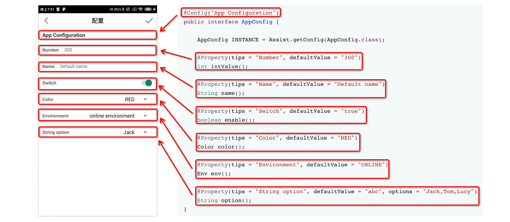

## Quick Start

1. Add dependency

   ```groovy
   implementation 'com.github.puke3615.android-assist:assist-api:1.0.3'
   // Optional (Only take effect in debug environment)
   debugImplementation 'com.github.puke3615.android-assist:assist-core:1.0.3'
   ```

2. Define a Java interface

   ```java
   @Config("App Configuration")
   public interface AppConfig {
   
       AppConfig INSTANCE = Assist.getConfig(AppConfig.class);
   
       @Property(tips = "Number", defaultValue = "300")
       int intValue();
   
       @Property(tips = "Name", defaultValue = "Default name")
       String name();
   
       @Property(tips = "Switch", defaultValue = "true")
       boolean enable();
   
       @Property(tips = "Color", defaultValue = "RED")
       Color color();
   
       @Property(tips = "Environment", defaultValue = "ONLINE")
       Env env();
   
       @Property(tips = "String option", defaultValue = "abc", options = "Jack,Tom,Lucy")
       String option();
   }
   ```

3. Use it

   ```java
   String name = AppConfig.INSTANCE.name();
   ```

   

## Code-Page Mapping

Just define a Java interface, the config page will auto generated by Assist framework.

You can enter config page by shake device if you add assist-core dependency.

